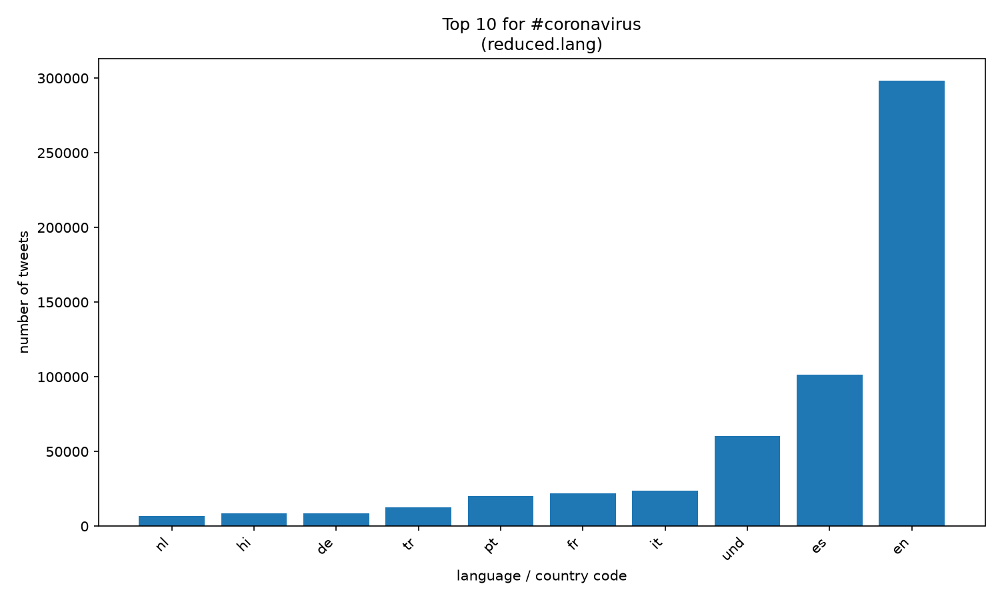
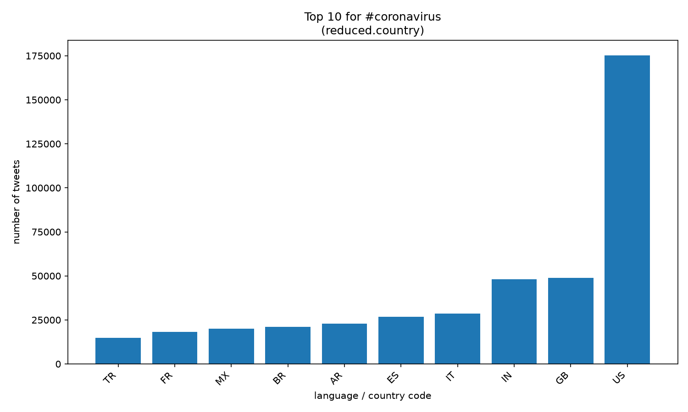

# Coronavirus Twitter Analysis (2020)

A MapReduce-style analysis of every geotagged tweet sent in 2020 (~1.1 billion tweets, ~366 daily zip files) to track how coronavirus-related hashtags spread across languages, countries, and time.

## What I built

**Map (`src/map.py`)** — Processes one day of tweets. For each tweet it checks the text against a list of coronavirus-related hashtags and, for every match, increments two nested counters: one keyed by the tweet's language code (`lang`) and one keyed by the country it was sent from (`place.country_code`). Tweets with missing or malformed location data are handled gracefully rather than crashing the job. Each run writes a `.lang` and a `.country` JSON file to `outputs/`.

**Parallel execution (`run_maps.sh`)** — Loops over all 2020 data files and launches one `map.py` process per day using `nohup` and `&`, so all ~366 jobs run concurrently on the server and keep running after I disconnect.

**Reduce (`src/reduce.py`)** — Merges the hundreds of daily output files into a single yearly total by element-wise addition of the nested counters, producing `reduced.lang` and `reduced.country`.

**Visualize (`src/visualize.py`)** — Reads a reduced file, pulls the counts for a given hashtag, and plots the top 10 keys as a sorted bar chart saved to PNG.

**Alternative reduce (`src/alternative_reduce.py`)** — Takes a list of hashtags on the command line, scans the daily `outputs/` files directly, and plots daily tweet volume for each hashtag over the course of the year as one line per hashtag.

## Results

### `#coronavirus` by language

### `#coronavirus` by country

### `#코로나바이러스` (Korean for "coronavirus") by language

### `#코로나바이러스` by country

### Hashtag usage over the year

Daily tweet counts for `#coronavirus`, `#covid19`, and `#corona`, produced by `src/alternative_reduce.py`.

A few things stand out:

- `#coronavirus` shows a small first bump around day 30 (late January, when the WHO declared a global health emergency), then explodes to a peak of roughly 15,000 tweets/day around day 72 — the week the WHO declared a pandemic (March 11).
- `#covid19` is essentially absent until day ~42, when the WHO officially named the disease. It overtakes `#coronavirus` by day ~80 and stays the dominant tag for the rest of the year at 1,500–2,500 tweets/day, while `#coronavirus` fades to a few hundred.
- `#corona` peaks near 4,000 tweets/day around day 70 and then declines steadily.
- There is a sharp one-day spike in `#covid19` near day 276 (early October), coinciding with the announcement that the U.S. president had tested positive.

The hashtag counts come from text matching, so `#coronavirus` tweets are also counted under `#corona`.

## Skills demonstrated

- Processing a terabyte-scale dataset that does not fit in memory, one shard at a time
- Designing map and reduce steps so the work parallelizes cleanly across hundreds of processes
- Unix process control: `nohup`, `&`, background jobs that outlive an SSH session
- Handling messy, multilingual JSON with missing fields
- Producing readable plots with matplotlib
