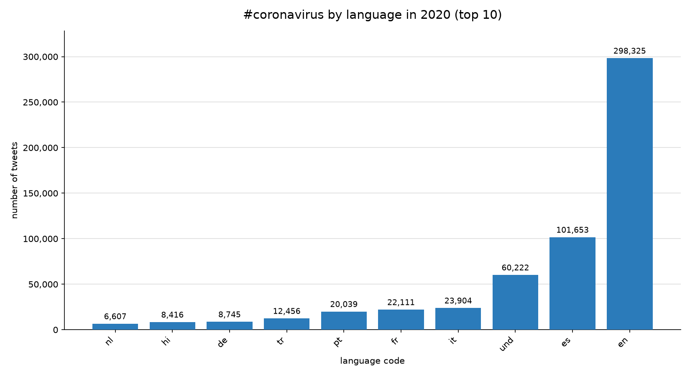
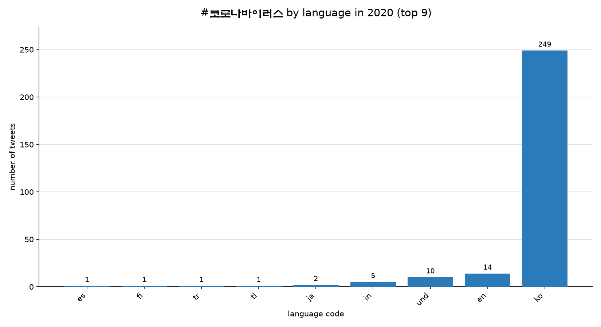
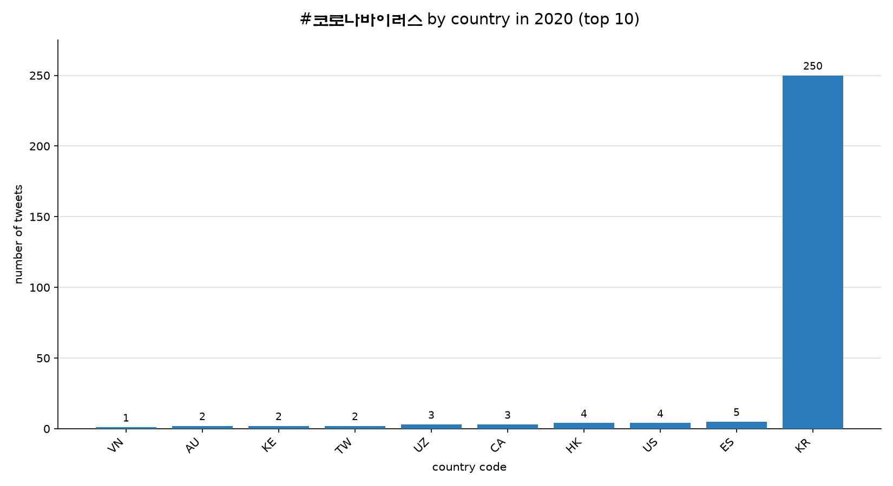
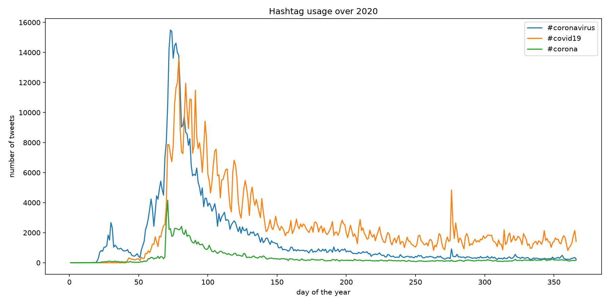

# Coronavirus Twitter Analysis (2020)

A MapReduce-style analysis of every geotagged tweet sent in 2020 — about 1.1 billion tweets across 366 daily archives — to track how coronavirus-related hashtags spread across languages, countries, and time.

## Approach

The dataset is far too large to load into memory, so the work is split into independent per-day jobs that run in parallel and are combined afterward.

| Step | File | What it does |
|---|---|---|
| **Map** | `src/map.py` | Reads one day of tweets (24 hourly files inside a zip). Extracts the hashtag tokens from each tweet with a Unicode-aware regex and matches them case-insensitively against the tracked list as whole tokens, so `#corona` is not credited for `#coronavirus`. For each match it increments two nested counters: one keyed by language (`lang`) and one by country (`place.country_code`). Malformed JSON lines and tweets with no `place` or `country_code` are handled without failing. Writes a `.lang` and a `.country` file to `outputs/`. |
| **Run** | `run_maps.sh` | Launches one `map.py` process per day of 2020 with `nohup` and `&`, so all 366 jobs run concurrently and keep running after the SSH session closes. |
| **Reduce** | `src/reduce.py` | Element-wise sums the 366 daily counters into yearly totals: `reduced/reduced.lang` and `reduced/reduced.country`. |
| **Visualize** | `src/visualize.py` | Plots the top 10 languages or countries for a given hashtag as a sorted bar chart. |
| **Time series** | `src/alternative_reduce.py` | Takes any list of hashtags, scans the daily outputs directly, and plots tweets per day over the year, one line per hashtag. |

## Results

### `#coronavirus` — top languages and countries

English dominates with roughly 300,000 tweets, about three times Spanish in second place. By country, the United States leads at ~175,000, followed by Great Britain and India at ~48,000 each; the remaining top-10 countries are a mix of European and Latin American.




### `#코로나바이러스` (Korean: "coronavirus") — top languages and countries

The Korean hashtag is tiny by comparison — about 250 tweets for the whole year — and almost entirely confined to Korean-language tweets sent from South Korea. Only nine languages used it at all. Korean speakers evidently tweeted about the pandemic under English hashtags instead.





### Daily hashtag volume over 2020

Daily tweet counts for `#coronavirus`, `#covid19`, and `#corona`.



What the plot shows:

- **`#coronavirus`** has a small first bump around day 30 (late January, WHO global health emergency), then surges to ~15,000 tweets/day around day 72 — the week the WHO declared a pandemic (March 11).
- **`#covid19`** is essentially absent until day ~42, when the WHO named the disease. It overtakes `#coronavirus` by day ~80 and stays dominant for the rest of the year at 1,500–2,500 tweets/day, while `#coronavirus` fades to a few hundred.
- **`#corona`** peaks near 4,000 tweets/day around day 70 and declines steadily.
- A sharp one-day spike in `#covid19` near day 276 (early October) coincides with the announcement that the U.S. president had tested positive.

Hashtags are matched as whole tokens, case-insensitively, so `#Coronavirus` and `#CORONAVIRUS` count toward `#coronavirus`, but a `#coronavirus` tweet does *not* count toward `#corona`. The three lines are therefore independent.

## Repository layout

```
src/            map.py, reduce.py, visualize.py, alternative_reduce.py
run_maps.sh     launches one map.py job per day of 2020 in parallel
hashtags        the hashtags tracked by the mapper
outputs/        per-day mapper output (.lang / .country), all 366 days
reduced/        yearly totals after the reduce step
plots/          all generated figures
```

## Reproducing the results

```sh
./run_maps.sh
./src/reduce.py --input_paths outputs/*.lang    --output_path reduced/reduced.lang
./src/reduce.py --input_paths outputs/*.country --output_path reduced/reduced.country
./src/visualize.py --input_path reduced/reduced.lang    --key '#coronavirus'   --output_path plots/coronavirus_by_language.png
./src/visualize.py --input_path reduced/reduced.country --key '#coronavirus'   --output_path plots/coronavirus_by_country.png
./src/visualize.py --input_path reduced/reduced.lang    --key '#코로나바이러스' --output_path plots/korean_coronavirus_by_language.png
./src/visualize.py --input_path reduced/reduced.country --key '#코로나바이러스' --output_path plots/korean_coronavirus_by_country.png
./src/alternative_reduce.py --hashtags '#coronavirus' '#covid19' '#corona' --output_path plots/hashtag_usage_over_2020.png
```
